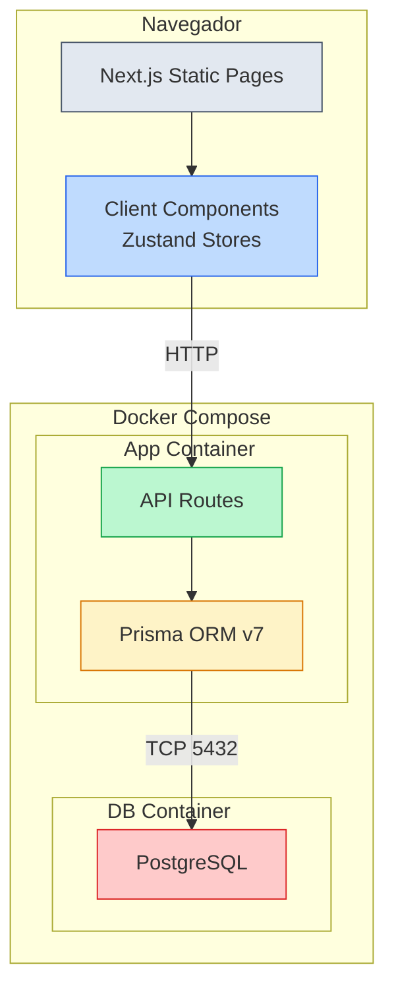

# Arquitectura



## Flujo de datos

```
Usuario → Página estática (Server Component)
         → Componente Cliente
         → Hook (useAthlete / useObjectives / useTraining)
         → Zustand Store → fetch(/api/...)
         → Next.js API Route
         → Prisma ORM → PostgreSQL
         → JSON → Zustand Store → React re-renderiza
```

## Modelo de datos

```
Athlete 1──N TrainingObjective
Athlete 1──N TrainingPlan
TrainingPlan ── JSON ──> WeekPlan[]
WeekPlan ── JSON ──> Workout[]
Workout ── JSON ──> Interval[]
```

## Stack

| Capa | Tecnología |
|---|---|
| Frontend | Next.js 16 SSR + Tailwind CSS v4 |
| Estado UI | Zustand v5 |
| API | Next.js Route Handlers |
| ORM | Prisma v7 + @prisma/adapter-pg |
| DB | PostgreSQL 17 |
| Contenedor | Docker + Docker Compose |
| Despliegue | Render Web Service (Docker) |
