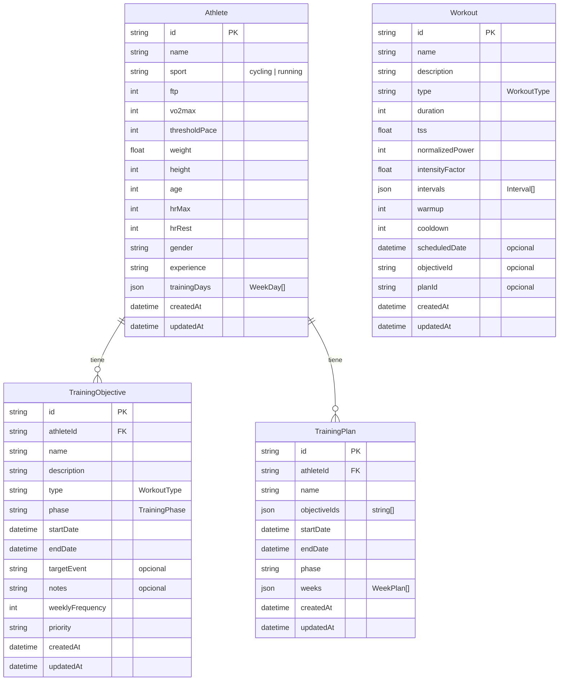

# Modelo de Base de Datos



## Relaciones

```
Athlete ──1:N── TrainingObjective   (onDelete: Cascade)
Athlete ──1:N── TrainingPlan         (onDelete: Cascade)
```

## Estructuras anidadas (JSONB)

```
TrainingPlan.weeks ──> WeekPlan[]
  WeekPlan {
    weekStart: string
    workouts: Workout[]
    totalTss: number
    plannedTss: number
  }

Workout.intervals ──> Interval[]
  Interval {
    id: string
    duration: number
    powerTarget?: number
    paceTarget?: number
    cadence?: number
    restAfter: number
    order: number
  }
```

## Notas

- `Workout` es una tabla independiente para la lista plana de workouts.
- Dentro de `TrainingPlan.weeks`, los `Workout` se duplican como JSON anidado (no hay FK a la tabla Workout).
- `objectiveIds` y `trainingDays` se almacenan como JSONB.
- Todos los IDs usan `cuid()` (generado por Prisma).
